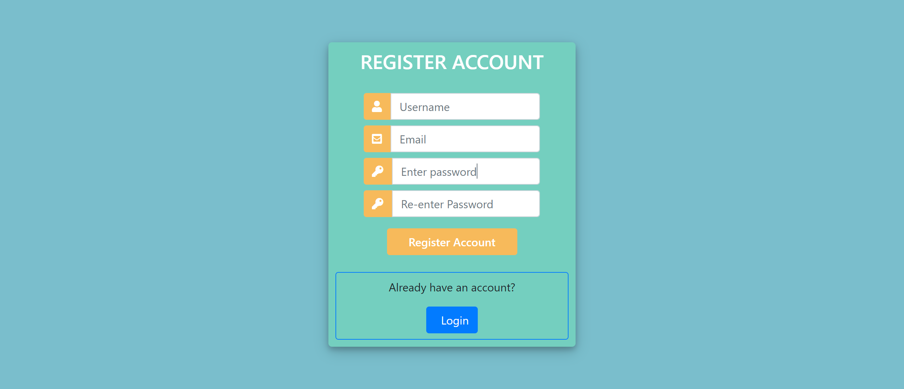
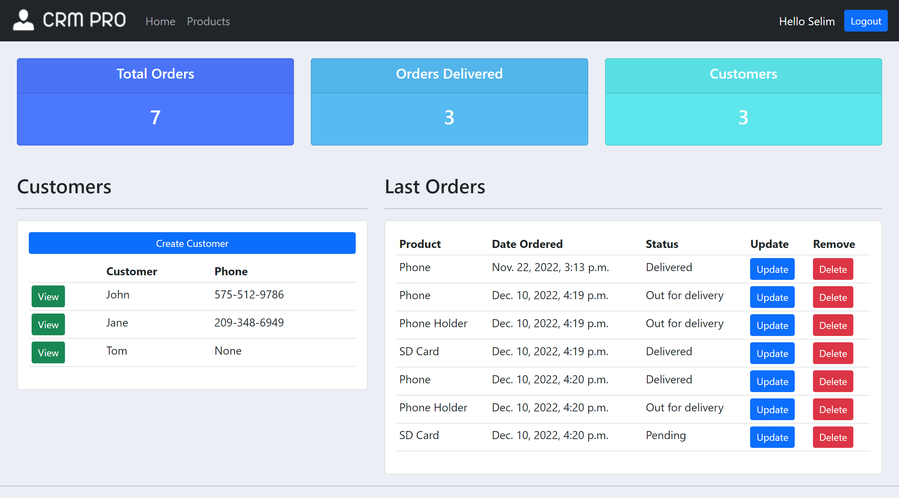
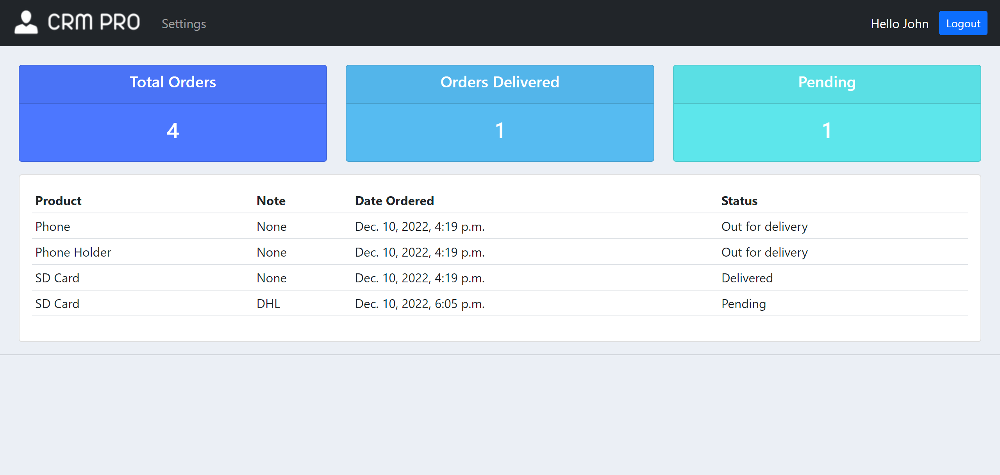
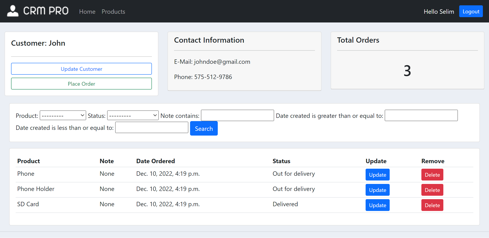
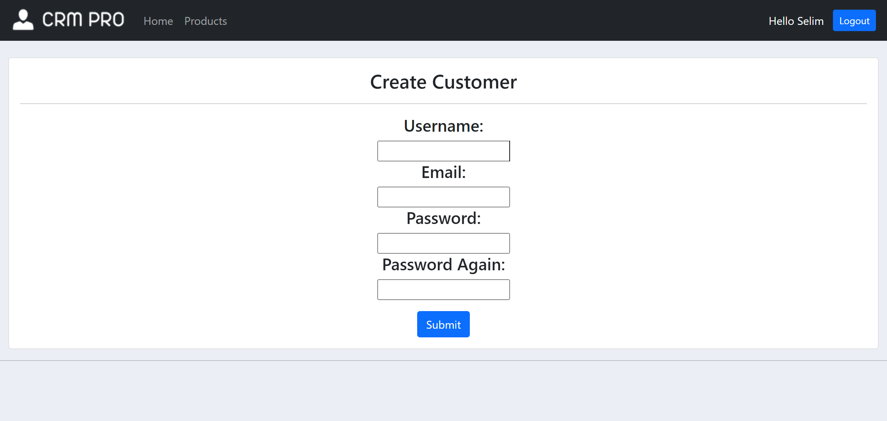
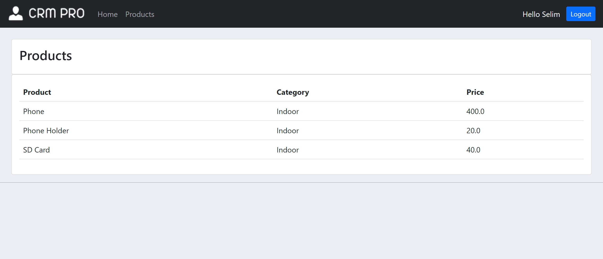
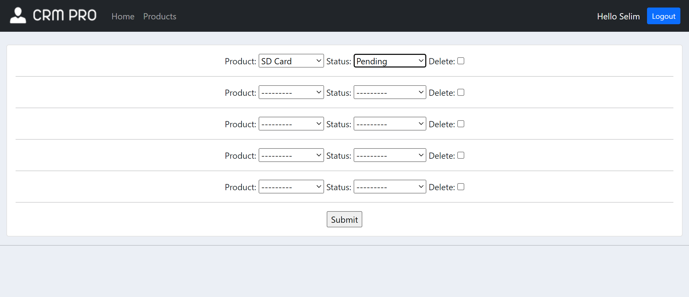

# CRM Application
Basic Django 4 CRM application. CRUD operations to company and orders.

## Requirements
- Django==4.1.3
- django_filter==22.1

## Login & Sign Up
 

## Homepage for admin and users
 

## Customer Page
 

## Products

## Place Order

